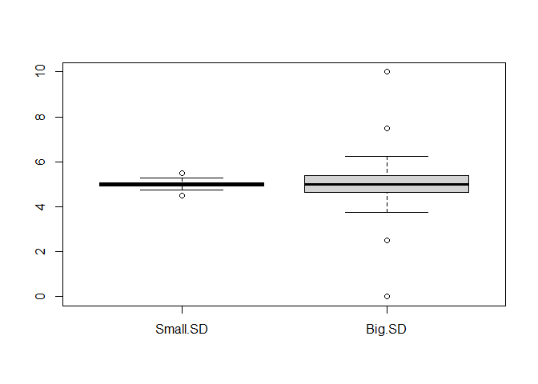

## A header to see what's going on!

This is going to be some random text and *trying* Alex's tips.

**Let's make this bold.**


```r
setwd("Data")
data <- read.csv("data.csv")
# plot(data)
```

<!-- -->
